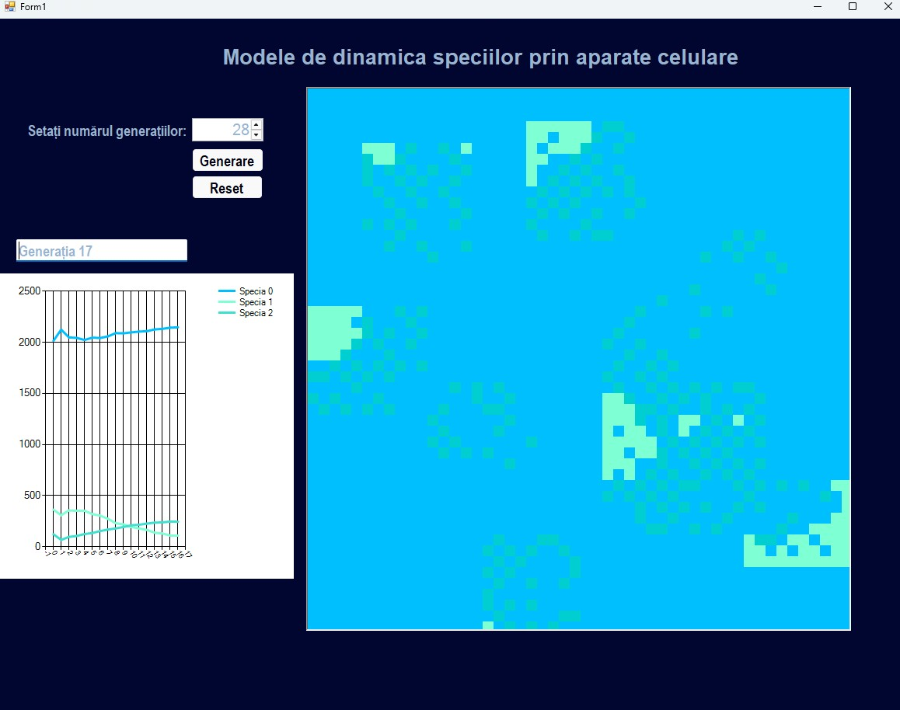

# Species Dynamics Simulator

A C# / Windows Forms cellular automaton that models multi-species population dynamics on a 50×50 grid, producing emergent behaviours like **Lotka-Volterra predator-prey oscillations**.



Each cell on the grid holds a species state. Every generation, cells evaluate their Von Neumann neighbours against a set of user-defined transition laws and update their state accordingly. Population counts per species are tracked over time and displayed on a live line chart, allowing you to observe predator-prey cycles emerge from simple local rules.

---

## Getting Started

1. Clone the repo and open `SpeciesDynamicsSimulator.sln` in Visual Studio (2019+, .NET Framework 4.x).
2. Build and run (`F5`).
3. Set the number of generations and click **Start**. Use **Reset** to return to the initial state.

---

## Input Files

| File | Purpose |
|---|---|
| `Species.txt` | Initial 50×50 grid — space-separated integers, one row per line |
| `NewLaws.txt` | Transition rules, one per line |

---

## Law Syntax

```
CurrentState {Species[min,max]; ...} NextState
```

A cell transitions if **all** neighbour conditions are met. The first matching rule wins. Neighbours are counted using Von Neumann (4 directions).


---

## Contributing

This project is developed in collaboration and is not open to external contributions. If you are the designated collaborator, create a feature branch, make your changes, and open a Pull Request against `main`. At least 1 approval is required to merge.