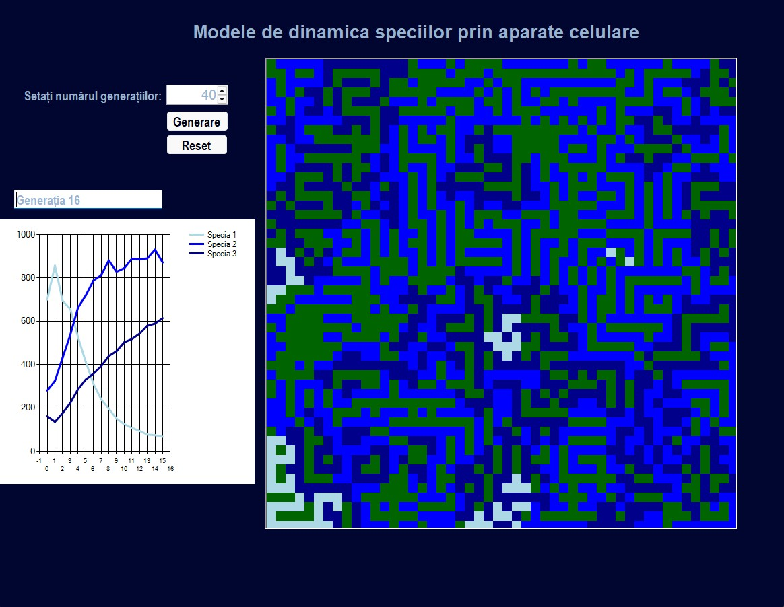

# Species Dynamics Simulator

A C# / Windows Forms cellular automaton that models multi-species population dynamics on a 50×50 grid, producing emergent behaviours like **Lotka-Volterra predator-prey oscillations**.

Each cell on the grid holds a species state. Every generation, cells evaluate their Von Neumann neighbours against a set of user-defined transition laws and update their state accordingly. Population counts per species are tracked over time and displayed on a live line chart, allowing you to observe predator-prey cycles emerge from simple local rules.

---

## 🏗️ Architecture (SOLID Principles)

This project was recently refactored to strictly adhere to **SOLID principles**, ensuring clean, maintainable, and highly decoupled code:

* **`SimulationEngine`**: The core business logic. Calculates neighbor states and applies transition laws without any dependencies on the UI.
* **`GridState`**: A pure data model holding the 50x50 matrix and population tracking.
* **`GridRenderer`**: Handles all graphical responsibilities (mapping species to colors and rendering the grid via GDI+).
* **`DataLoader`**: A dedicated file parser that reads initial grid states and transition laws from `.txt` files.
* **`Form1`**: Acts purely as the UI coordinator, completely decoupled from the simulation math and file parsing.

---

## 🚀 Getting Started

1. Clone the repo and open `SpeciesDynamicsSimulator.sln` in Visual Studio (2019+, .NET Framework 4.x).
2. Build and run (`F5`).
3. Set the number of generations and click **Generare (Start)**. Use **Reset** to return to the initial state.

---

## 📂 Input Files

The simulation loads data from text files at startup. Default files included:

| File | Purpose |
|---|---|
| `3SpeciesMatrix.txt` / `2SpeciesMatrix.txt` | Initial 50×50 grid — space-separated integers, one row per line. |
| `PreyPredatorPredatorCompetitionLaws.txt` | Transition rules, one per line. |

---

## 📜 Law Syntax

Transition laws are defined using the following syntax:

`CurrentState {Species[min,max]; ...} NextState block/allow`

A cell transitions to the `NextState` if **all** neighbour conditions are met. Neighbours are counted using the Moore neighborhood. 

**Example:**
`1 {1[2,4]; 2[0,1]} 0 -`
*(If a cell of Species 1 has between 2 to 4 neighbors of Species 1, and 0 to 1 neighbors of Species 2, it transforms into Species 0).*

---

## 🤝 Contributing

This project is developed in collaboration and is not open to external contributions. If you are the designated collaborator, create a feature branch, make your changes, and open a Pull Request against `main`. At least 1 approval is required to merge.